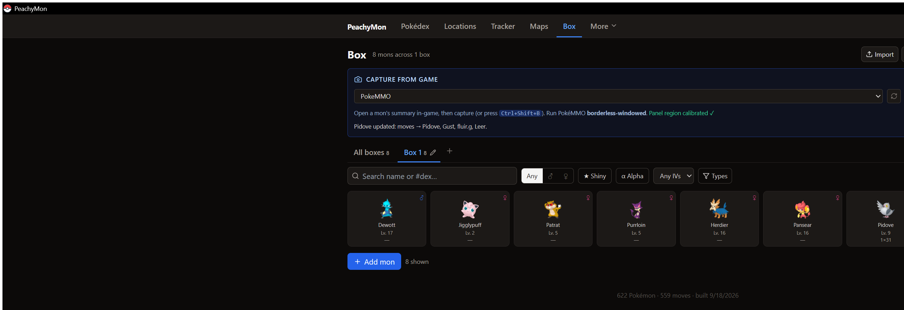

# PeachyMon

**A PokéMMO toolkit for Windows that reads your Pokémon straight off the game screen.**

Open a Pokémon's summary in PokéMMO, press **Ctrl+Shift+B**, and it lands in your Box — species, level, nature, IVs, moves, ability and held item — without typing a single number. From there you get a Pokédex, encounter finder, maps, damage and catch calculators, a team builder, gym prep, and a breeding planner.

PeachyMon is a fork of [**PokeKit** by TyrAntitar](https://github.com/AntProj/PokeKit), which is where all the toolkit and the dataset come from. This fork rebuilds the desktop capture so it reliably reads **all three summary screens**, and adds Box/export features around it.

Built and played by **kaypeaches** — say hi in-game.

<p align="center">
  
</p>

---

## Why this fork exists

Windows' built-in text recognition reads PokéMMO's summary panel badly, and the original capture assumed it reads cleanly. Every fix here comes from real captures:

- **"IV:" is mangled differently on every row** — `HPIV:`, `'v:`, `Atk1V:`, `DeflV:`. Rows are found by their stat name instead, and the HP label is often dropped entirely, so the six values are matched by their position in the value column.
- **The header sits level with the HP row**, so the HP value can get grouped with "Lv. 13" instead of its own label. Values are matched by position on screen, not by text line.
- **PP lines lose their prefix** — `35/35`, or `30130` when the slash is read as a 1. A PP line is recognized by its shape, not the letters "PP".
- **Type badges bleed into the row next to them** — `Tackle normal`, `Torrent water`. The longest run of words that is a real move or ability wins.
- **Near-misses are corrected**, preferring moves the species can actually learn, and a genuine tie (`Water Spon` → Water Sport or Water Spout?) is left alone rather than guessed.

## Capture

| Summary screen | What it reads |
| --- | --- |
| **Info** (Pokédex / Name / Nature) | species, nature, nickname, level, held item |
| **IVs** | all six IVs, level, held item |
| **Moves** | four moves, ability, level, held item |

**Nothing open in the Box** → a capture on the info screen adds a new Pokémon, and ticks its species off in the Tracker.

**A Pokémon open in the Box** → a capture updates *that* Pokémon and says what changed (`Lv. 9 → 11, moves → Tackle, Focus Energy, Water Gun, Soak`), or tells you it's already up to date. Capturing a different species is refused — unless it's an evolution of the open one, which updates it in place.

Levelled up and evolved? The Box editor has an **Evolve → Dewott** button that keeps the same Pokémon's IVs, level and moves.

## Taking your team to an AI chat

The Box has a **Copy for AI** button that copies everything as plain text:

```
Oshawott ♂, Lv. 11, Quirky nature, ability Torrent, held item: none,
IVs 15/15/15/15/15/15, moves: Tackle / Water Sport / Water Gun / Soak
```

Paste that into any AI chat and ask what to fix. Team Builder also exports **Showdown format**, which AI chats already understand.

## Everything else (from upstream PokeKit)

Pokédex with deep filters · encounter Locations finder · catch Tracker · interactive region Maps · Damage Calc on a PokéMMO-accurate engine · Team Builder with weakness, coverage and speed-tier analysis · Gym & E4 Prep with counters pulled from your Box · a breeding planner that factors in the Pokémon you already own.

The full toolkit is documented in the [upstream README](https://github.com/AntProj/PokeKit#readme), and the web version runs at [antproj.github.io/PokeKit](https://antproj.github.io/PokeKit/).

## Install

There's no prebuilt download yet — build it yourself:

```bash
git clone https://github.com/LeSteak11/PeachyMon
cd PeachyMon
npm install
npm run build:data       # builds the dataset (required once)
npm run build:trainers
npm run desktop:build    # Windows installer in src-tauri/target/release/bundle/nsis/
```

Needs **Node ≥ 20.6**, the **Rust toolchain** (MSVC) and the **Microsoft C++ Build Tools**. See [DESKTOP.md](DESKTOP.md).

> **Windows note:** install it somewhere outside `AppData` (e.g. `C:\Tools\PeachyMon`) if you launch it from a sandboxed app, or you may end up running an old copy.

## First run

1. Run PokéMMO in **borderless-windowed** mode.
2. Open the **Box** tab and pick the PokéMMO window.
3. Open any Pokémon's summary in-game, click **Calibrate**, and drag a box around the **whole summary window** — both halves. Once, and it's remembered.
4. Press **Ctrl+Shift+B** on each summary screen.

Everything is stored locally on your machine. No account, no server, nothing uploaded.

## Credits

- **[PokeKit by TyrAntitar](https://github.com/AntProj/PokeKit)** — the app, the data pipeline and the curated dataset this is built on. MIT licensed; this fork keeps that license.
- Game data from the PokéMMO Hub, [pokemmo.fandom.com](https://pokemmo.fandom.com/) (CC-BY-SA), a community Gym Leader Team Query Form, and PokeAPI-derived text.
- Damage engine: a PokéMMO-patched fork of Smogon's [`@smogon/calc`](https://github.com/smogon/damage-calc).

## Disclaimer

Unofficial and fan-made. Not affiliated with or endorsed by PokéMMO, Nintendo, Game Freak or The Pokémon Company. Pokémon and all related names are trademarks of their respective owners. It reads your screen locally and never automates or plays the game for you.
